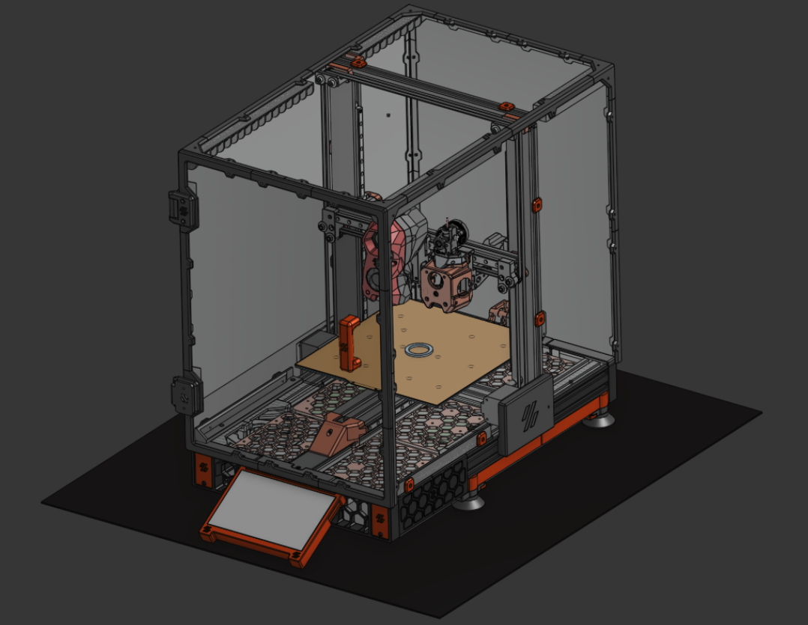

# SwitchVyper

An Anycubic Vyper converted into a Voron Switchwire-style 3D printer.

## Project links and files

- [Open the model in Onshape](https://cad.onshape.com/documents/62e498963ce5b7d11e01016b/w/9bc06041d175bc1c8eee53e1/e/2dd8f0ed1904c32c20e834ee?renderMode=0&uiState=6ab9696db8913e857fae64c3)
- [Download the complete assembly as STEP](SwitchVyper.step)

## What changed

### Reused from the Anycubic Vyper

- Original aluminium frame
- Power supply
- Some end stops

### Added or replaced

- Printed frame components and chamber
- Linear rails
- Voron Stealthburner toolhead

## CAD model

The Onshape model is organized into these assemblies:

- Ground frame
- Printed frame
- Electronics
- Y-axis
- XZ-axis
- Chamber

The electronics and standard hardware are modeled only in basic detail. The model also includes imported toolhead options:

- Voron Stealthburner with PCB, without stepper motor
- A4T toolhead with Orbiter 2.5 and Rapido UHF 2.0

## Hardware notes

- Raspberry Pi 4B+ with 4 GB RAM
- 120 W power supply
- BIGTREETECH SKRat V1.0 mainboard
- TMC2209 V1.3 stepper drivers
- EBB36 toolhead board for CAN bus
- MCU serial device: `/dev/serial/by-id/usb-1a86_USB_Serial-if00-port0`

### Toolhead parts noted in the build

- Trianglelab BMG extruder kit
- Harness for a 350 mm Voron 2.4 with Frombot kit cables
- Klicky probe, without microswitch
- Phaetus Dragon Standard Flow hotend, 45.6 mm
- XY PCB and cable
- GDSTime fans

## Configuration and build notes

- Mainsail provides the web interface; Moonraker provides the API used by the interface.
- Klipper runs on the printer controller board.
- OrcaSlicer part cooling is configured under **Filament > Cooling**.
- Firmware retraction is enabled in `printer.cfg`.
- Check `rotation_distance` when calibrating extrusion and flow.
- The printer was converted to CAN bus with an EBB36 toolhead board on 20 June 2026.
- The printer was previously reachable on the local network at `192.168.178.104` (HTTP port `80`; Moonraker port `7125`). This address is specific to that network.

## Build log

### 4 November 2024

- Recorded the original controller and network setup.
- Documented the Stealthburner, extruder, hotend, probe, PCB, and fan setup.

### 18 December 2025

- Added TMC2209 V1.3 drivers and a BIGTREETECH SKRat V1.0 mainboard.

### 28 December 2025

Parts estimate recorded for a toolhead and CAN-bus upgrade:

- EBB36 Gen 1: about €15
- U2C: about €15
- Two 4010 fans: about €15–20
- One 2510 fan: about €10
- X1C hotend: about €15
- LEDs, cables, and small parts: about €10
- Umbilical cable: about €10

These are historical estimates, not a current shopping list.

### 9 January 2026

- Set up part cooling in OrcaSlicer under **Filament > Cooling**.

### 20 June 2026

- Converted the printer to CAN bus with an EBB36 toolhead board.
- Adjusted the macros.

### 4 July 2026

- Calibration and macro updates noted.
- Enabled firmware retraction in `printer.cfg`.
- Noted that `rotation_distance` affects extrusion and flow calibration.

### 1 September 2026

- Replaced the CW2 latch after it broke and stopped gripping filament correctly.

## To do

- [ ] Add multi-material support with EMU.
- [ ] Add a toolhead cutter.
- [ ] Explore toolheads optimized for TPU and other materials.
- [ ] Attach a passive heatsink to the Raspberry Pi, if needed.
- [ ] Connect the 24 V filter fans.
